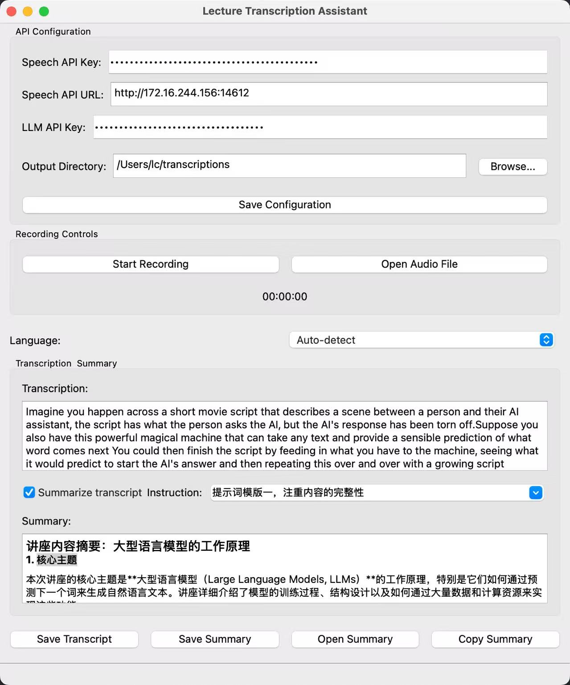

# 404NotSound

&#x20;

[Chinese](./docs/README.zh-CN.md) | [English]

**404NotSound integrates the open-source speech recognition project ********************[SenseVoice](https://github.com/FunAudioLLM/SenseVoice)******************** and the ********************[DeepSeek API](https://api-docs.deepseek.com/)******************** for classroom or lecture transcription. It utilizes DeepSeek for organization and outputs summaries in Markdown format.**

[//]: # (![img_1.png]&#40;./docs/img_1.png&#41;)
 

## Table of Contents

- [Project Overview](#project-overview)
- [Quick Start](#quick-start)
  - [Client Side](#client-side)
  - [Server Side](#server-side)
- [Development Roadmap](#Development Roadmap)

## Project Overview

As the project name suggests, 404NotSound subtly represents situations in class where students often say, "Sorry, I didn't hear that." This project currently uses PySide6 as the GUI framework, SenseVoice as the speech recognition engine, and DeepSeek as the LLM-based summarization engine.

For example:
If you input a 3Blue1Brown video (extracting only the audio for now, with potential future support for video), the original video links are:
[https://www.bilibili.com/video/BV1xmA2eMEFF](https://www.bilibili.com/video/BV1xmA2eMEFF)[ ](https://www.bilibili.com/video/BV1xmA2eMEFF)(Bilibili)
[https://youtu.be/LPZh9BOjkQs](https://youtu.be/LPZh9BOjkQs)[ ](https://youtu.be/LPZh9BOjkQs)(YouTube).

The text recognized by SenseVoice is as follows:

<details> 
<summary><font size="4" color="orange">Expand recognition text</font></summary> 
<pre><code class="text-xl">Imagine you happen across a short movie script that describes a scene between a person and their AI assistant,
the script has what the person asks the AI, but the AI's response has been torn off.
Suppose you also have this powerful magical machine that can take any text and provide
a sensible prediction of what word comes next You could then finish the script by
feeding in what you have to the machine, seeing what it would predict to start
the AI's answer and then repeating this over and over with a growing script completing
the dialogue When you interact with a chatbot, this is exactly what's happening a large
language model is a sophisticated mathematical function that predicts what word comes
next for any piece.🎼of text instead of predicting one word with certainty, though, what
it does is assign a probability to all possible next words to build a chatbot What you do
is lay out some text that describes an interaction between a user and a hypothetical AI assistant
you add on whatever the user types in as the first part of that interaction and then you have the
model repeatedly predict the next word that such a hypothetical AI assistant would say in response
and that's what's presented to the user in doing,The output tends to look a lot more natural if
you allow it to select less likely words along the way at random, so what this means is even though
the model itself is deterministic, a given prompt typically gives a different answer each time it's
run.Models learn how to make these predictions by processing an enormous amount of text typically
pulled from the internet for a standard human to read the amount of text that was used to train GPT3,
for example, if they read nonstop 24/7, it would take over 2,600 years, larger models since then train
on much, much more.You can think of training a little bit like tuning the dials on a big machine, the
way that a language model behaves is entirely determined by these many different continuous values,
usually called parameters or weights.🎼Changing those parameters will change the probabilities that
the model gives for the next word on a given input, what puts the large in large language model is 
how they can have hundreds of billions of these parameters.No human ever deliberately sets those
parameters, instead they begin at random, meaning the model just outputs gibberish, but they are
repeatedly refined based on many example pieces of text.One of these training examples could be just
a handful of words, or it could be thousands, but in either case, the way this works is to pass in all
but the last word from that example into the model and compare the prediction that it makes with the
true last word from the example, an algorithm called back propagation is used to tweak all of the
parameters in such a way that it makes the model a little more likely to choose the true last word and
a little less likely to choose all the others.When you do this for many, many trillions of examples, not
only does the model start to give more accurate predictions on the training data, but it also starts to
make more reasonable predictions on text that it's never seen before.Given the huge number of parameters
and the enormous amount of training data, the scale of computation involved in training a large language
model is mind boggling.To illustrate, imagine that you could perform 1 billion editions and multiplications
every single second, how long do you think that it would take for you to do all of the operations involved
in training the largest language models?Do you think it would take a year, maybe something like 10,000
years, The answer is actually much more than that it's well over 100 million years.This is only part of
the story though This whole process is called pre-training The goal of auto completinglet a random passage
of text from the internet is very different from the goal of being a good AI assistant, to address this
chatbots undergo another type of training just as important called reinforcement learning with human feedback Workers flag unhelpful or problematic predictions and their corrections further change the model's parameters, making them more likely to give predictions that users prefer.Looking back at the pretraining though, this staggering amount of computation is only made possible by using special computer chips that are optimized for running many, many operations in parallel known as GPUs. However, not all language models can be easily parallelzed prior to 2017 Most language models would process text one word at a time, but then a team of researchers at Google introduced a new model known as the Transformer.Yeah.🎼Transformers don't read text from the start to the finish They soak it all in at once in parallel The very first step inside a transformer and most other language models for that matter is to associate each word with a long list of numbers The reason for this is that the training process only works with continuous values so you have to somehow encode language using numbers and each of these list of numbers may somehow encode the meaning of the corresponding word What makes transformers unique is their rely.On a special operation known asten.This operation gives all of these lists of numbers a chance to talk to one another and refine the meanings that they encode based on the context around, all done in parallel For example, the numbers encoding the word bank might be changed based on the context surrounding it to somehow encode the more specific notion of a river bank.Transformers typically also include a second type of operation known as a feed forwardward neural network, and this gives the model extra capacity to store more patterns about language learned during training.All of this data repeatedly flows through many different iterations of these two fundamental operations, and as it does so, the hope is that each list of numbers is enriched to encode whatever information might be needed to make an accurate prediction of what word follows in the passage.Yeah.At the end, one final function is performed on the last vector in this sequence, which now has had a chance to be influenced by all the other context from the input text, as well as everything the model learned during training to produce a prediction of the next word again, the model's prediction looks like a probability for every possible next word.🎼Yeah.Although researchers design the framework for how each of these steps work, it's important to understand that the specific behavior is an emergent phenomenon based on how those hundreds of billions of parameters are tuned during training. This makes it incredibly challenging to determine why the model makes the exact predictions that it does What you can see is that when you use large language model predictions to autocomplete a prompt. The words that it generates are uncannily fluent, fascinating and.Even useful.🎼If you're a new viewer and you're curious about more details on how transformers and attention work Boy do I have some material for you One option is to jump into a series I made about deep learning where we visualize and motivate the details of attention and all the other steps in a transformer but also on my second channel I just posted a talk that I gave a couple months ago about this topic for the company T and G in Munich Sometimes I actually prefer the content that I make as a casual talk rather than a produced video, but I leave it up to you which one of,Fel like the better follow on.</code>
</pre> </details>

Since the original text is lengthy, scroll right to view more.

After processing with DeepSeek, the output is as follows (plain text output, with an option to switch to Markdown format):

```markdown
Lecture Summary: How Large Language Models Work

1. Core Topic
This lecture focuses on the working principles of **Large Language Models (LLMs)**, particularly how they generate natural language text by predicting the next word. It details the model training process, structural design, and the extensive data and computational resources required.

2. Key Knowledge Points and Structure

2.1 Basic Functions of Language Models
- **Next-word prediction**: The core function of LLMs is predicting the next word in a given text. Instead of deterministically choosing a word, they assign probabilities to all possible words.
- **Generating natural language**: By repeatedly predicting the next word, the model generates coherent text or dialogue. To ensure natural output, models sometimes select lower-probability words randomly.

2.2 Training Process
- **Pre-training**:
  - The model learns to predict the next word from massive amounts of text (usually sourced from the internet).
  - For example, training GPT-3 required reading an amount of text that would take a human over 2,600 years to finish at a continuous reading pace.
  - Training adjusts the model's parameters (weights) that determine its behavior.
  - Using the **backpropagation algorithm**, the model optimizes its parameters iteratively for better predictions.
- **Reinforcement Learning with Human Feedback (RLHF)**:
  - To make the model more suitable as an AI assistant, an additional training phase involves human feedback.
  - Human reviewers mark incorrect or inappropriate responses, refining the model’s outputs.

2.3 Model Scale and Computational Demand
- **Parameter Count**: Large models typically have tens of billions of parameters that continuously adjust during training.
- **Computational Resources**: Training these models requires enormous computing power.
  - For instance, training the largest models, even at 1 billion operations per second, would take over 100 million years.
- **Hardware Support**: Training relies heavily on GPUs (Graphics Processing Units), which can handle massive parallel computations.

2.4 Transformer Architecture
- **Parallel Processing**: Unlike early language models that process words sequentially, Transformer models process entire text sequences simultaneously.
- **Word Embedding**: Each word is encoded as a long vector of numbers, which is fine-tuned during training to capture semantic meaning.
- **Attention Mechanism**:
  - The Transformer’s core operation allows the model to adjust word representations dynamically based on context.
  - For example, the word “bank” is encoded differently depending on whether the context is “river bank” or “bank account.”
- **Feedforward Neural Networks**: The Transformer also includes feedforward networks to store complex language patterns.

2.5 Prediction and Output Generation
- **Final Predictions**: At the last stage, the Transformer generates the next-word probability distribution based on its training data.
- **Emergent Behavior**: The model’s behavior emerges from billions of parameter adjustments, making it difficult for researchers to fully interpret its reasoning process.

3. Key Details
- **Training Data Volume**: The amount of text used for training GPT-3 equals a human reading for 2,600 years.
- **Computation Time**: Training the largest models requires more than 100 million years (assuming 1 billion operations per second).
- **Role of Attention Mechanism**: Enables the model to dynamically adjust word meanings based on context.
- **Role of Reinforcement Learning**: Human feedback refines the model to generate more user-friendly responses.

4. Further Topics
- **Origin of Transformers**: The Transformer architecture was introduced by Google in 2017 and revolutionized language model training.
- **Visualization of Attention Mechanism**: The lecture suggests deep learning videos to further explore attention mechanisms.

5. Summary
This lecture explores how large language models work, from basic next-word prediction to complex training processes and Transformer architecture design. By leveraging vast data and computational resources, these models generate natural-sounding text, though their behavior remains an emergent phenomenon that is not entirely understood.
```

### Quick Start

#### Client Side

Clone this project, install dependencies, and run:

```bash
git clone https://github.com/FrankLightcone/404NotSound.git
cd 404NotSound
pip install -r requirements.txt
python app.py
```

#### Server Side

You need to install dependencies for SenseVoice. Refer to the [SenseVoice](https://github.com/FunAudioLLM/SenseVoice)[ ](https://github.com/FunAudioLLM/SenseVoice)installation guide.

Run the SenseVoice server:

```bash
python api_key_server.py
```

Specify the SenseVoice API address in the client settings. On first run, an admin API key is generated. With this key, you can create a new API key using\:

```bash
curl -k -X POST "https://<Your Server IP Address>:14612/admin/create_key" \
     -H "X-API-Key: <Your Server Admin API Key>" \
     -H "Content-Type: application/json" \
     -d '{}'
```

For DeepSeek-related issues, refer to the [DeepSeek API](https://api-docs.deepseek.com/) documentation.

### Development Roadmap

- [x] Completed basic GUI interface
- [x] Support video input
- [ ] UI optimization
- [ ] Support simultaneous input of course PPT
- [ ] Historical data storage and retrieval
- [ ] Support using other LLM models
- [ ] Support multi-turn conversation

